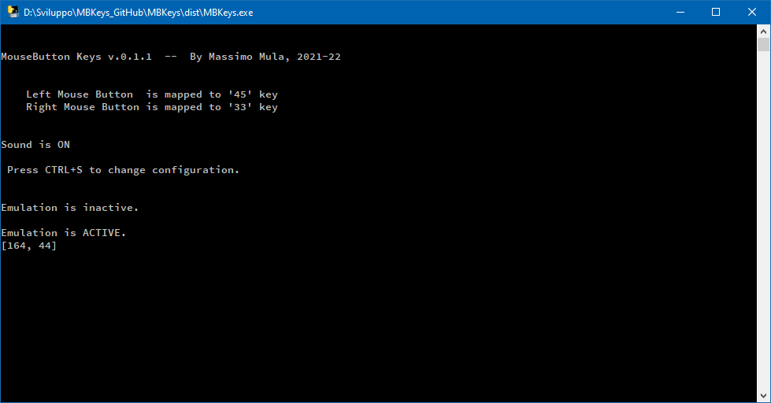

# MBKeys
Mouse Buttons (emulated by) Keys

This utility emulates mouse clicks by interacting with the Windows API (no Linux, sorry). 
Buttons are mapped like that:

  - Ins &nbsp;&nbsp;&nbsp;&nbsp;&nbsp;&nbsp;&nbsp;&nbsp;&nbsp;&nbsp;&nbsp;&nbsp;&nbsp;&nbsp;&nbsp;-->  Left button
  - Page Up &nbsp;&nbsp;&nbsp;&nbsp;&nbsp;&nbsp;-->   Right button
  - Scroll Lock&nbsp;&nbsp;&nbsp; --> Turn emulation On/Off
  

  
 
<b>Why this program?</b>

I'm an OpenStreetMap contributor since a long time: I like very much to map things over the world and -as you can imagine- I do a lot of mouse clicks when doing it.

After destroying a couple of mice by literally wearing out their micro-switches and started having wrist cramps, I decided to find some application allowing me to emulate the mouse buttons by pressing keys on my keyboard; I found a viable solution with the NeatMouse application, a freeware for Windows (https://neatdecisions.com/products/neatmouse/) and used it for a few years... until I got a laptop from my company where that program was not allowed to run.

I then decided to write myself a similar utility: I had quite a good knowledge of Python: that was a good chance to learn something about interaction with Windows API... and MBKeys was the result.

The code of MBKeys is not optimized, it's just working. Hope it can be useful to someone else, however.

 
<b>KNOWN ISSUES</b>

  * The CTRL-S key combo actually does nothing. 
  
  * Program configuration can be changed by manually editing the config.ini file that *must* be placed in the same directory as the main program
  
  * Keys are mapped by their keystroke value (so *Ins* is *45* and *PgUp* is *33*). Unfortunately no full mapping is proveded here
  * Program is not very fast (well, it's fast like a Python script can be): let's say it's good enough for my needs; I got a little improvement by compiling it into a stand-alone .exe, but I would not use it in an intensive gaming session :-)
  
  
